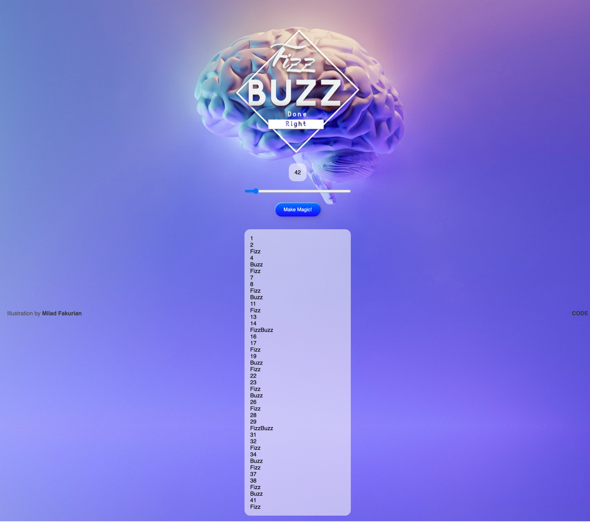

# FizzBuzz

An implementation of the [FizzBuzz](https://en.wikipedia.org/wiki/Fizz_buzz) coding problem as a webpage.
Made using html, css and javascript with a focus on simple usability and to look great on mobile without the use of
media queries.

---

 